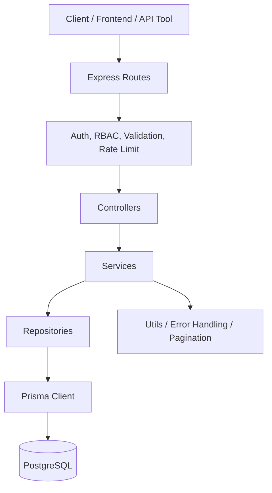
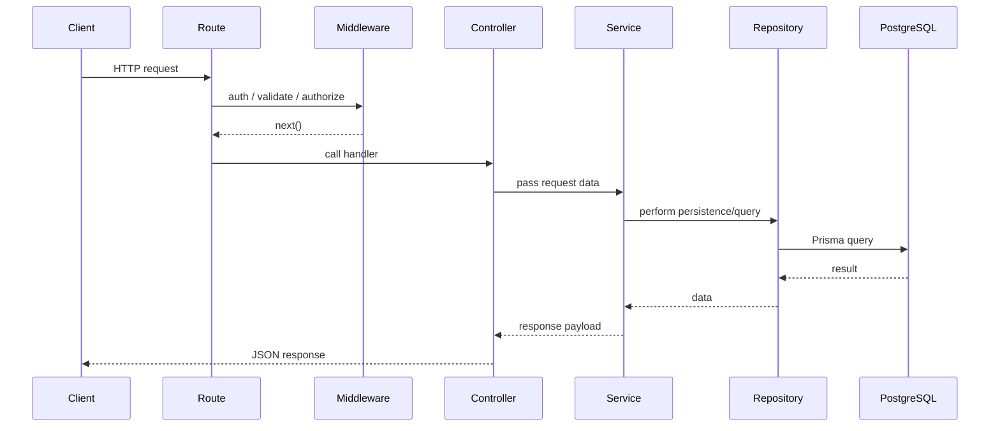

# Zorvyn Finance Backend Assignment

## What This Repository Is

This repository is a clean backend for finance data processing. It is built with Node.js, Express, TypeScript, Prisma, PostgreSQL, Zod, JWT, bcrypt, and dotenv.

The goal of the project is to demonstrate a production-style backend with:

- user management and role-based access control
- financial record CRUD and filtering
- dashboard analytics and aggregates
- centralized validation and error handling
- repository/service/controller separation
- test coverage for core flows and edge cases

## High-Level Architecture

The codebase follows a simple layered architecture:

- Controllers handle HTTP request and response only.
- Services contain business logic only.
- Repositories contain Prisma queries only.
- Middleware handles auth, RBAC, validation, errors, and rate limiting.
- Prisma handles persistence against PostgreSQL.



## Request Lifecycle



## Repository Layout

```text
zorvyn/
├── prisma/
│   ├── schema.prisma
│   └── seed.ts
├── src/
│   ├── modules/
│   │   ├── auth/
│   │   ├── user/
│   │   ├── record/
│   │   └── dashboard/
│   ├── middlewares/
│   ├── utils/
│   ├── config/
│   ├── types/
│   ├── app.ts
│   └── server.ts
├── tests/
│   ├── unit/
│   └── integration/
├── .env
├── .env.example
├── .gitignore
├── package.json
├── prisma.config.ts
├── tsconfig.json
└── README.md
```

## Tech Stack

- Node.js + Express for the server
- TypeScript for static typing
- Prisma ORM for database access
- PostgreSQL for persistence
- Zod for request validation
- JWT for authentication
- bcrypt for password hashing
- dotenv for environment variables
- Vitest and Supertest for tests

## Domain Model

### User

Fields:

- `id`
- `email`
- `password`
- `role`
- `status`
- `createdAt`

Roles:

- `ADMIN`
- `ANALYST`
- `VIEWER`

Status values:

- `ACTIVE`
- `INACTIVE`

### Record

Fields:

- `id`
- `amount`
- `type`
- `category`
- `date`
- `note`
- `userId`
- `createdAt`
- `deletedAt`

Record types:

- `INCOME`
- `EXPENSE`

Soft delete is implemented with `deletedAt` instead of hard deletion.

## Prisma Data Model

```mermaid
erDiagram
  User ||--o Record : owns

  User {
    string id PK
    string email UK
    string password
    Role role
    Status status
    datetime createdAt
  }

  Record {
    string id PK
    decimal amount
    RecordType type
    string category
    datetime date
    string note
    string userId FK
    datetime createdAt
    datetime deletedAt
  }
```

## Database Schema

This is the actual relational shape used by Prisma and PostgreSQL.

```text
+----------------------+
|        User          |
+----------------------+
| id          PK       |
| email       UNIQUE   |
| password             |
| role                 |
| status               |
| createdAt            |
+----------------------+
           |
           | 1
           | \
           |  \ owns many
           |   \
           |    v
+----------------------+
|       Record         |
+----------------------+
| id          PK       |
| amount               |
| type                 |
| category             |
| date                 |
| note                 |
| userId      FK ------+----> User.id
| createdAt            |
| deletedAt            |
+----------------------+
```

### Relation Rules

- One `User` can own many `Record` rows.
- Every `Record` belongs to exactly one `User` through `userId`.
- `Record.userId` is a foreign key to `User.id`.
- Deleting a user cascades to their records at the Prisma relation level.
- `deletedAt` on `Record` supports soft delete, so records stay in the database but are excluded from normal reads.

## Prisma and Persistence Notes

- Prisma schema lives in [prisma/schema.prisma](prisma/schema.prisma).
- Connection configuration is handled by [prisma.config.ts](prisma.config.ts).
- Seeding lives in [prisma/seed.ts](prisma/seed.ts).
- `Record.deletedAt` supports soft delete and is filtered out in read queries.

## Module Breakdown

### Auth Module

Files:

- [src/modules/auth/auth.controller.ts](src/modules/auth/auth.controller.ts)
- [src/modules/auth/auth.service.ts](src/modules/auth/auth.service.ts)
- [src/modules/auth/auth.repository.ts](src/modules/auth/auth.repository.ts)
- [src/modules/auth/auth.routes.ts](src/modules/auth/auth.routes.ts)
- [src/modules/auth/auth.validator.ts](src/modules/auth/auth.validator.ts)

Responsibilities:

- register users
- log users in
- issue JWTs
- hash passwords with bcrypt
- fetch the current user profile

Important behaviors:

- duplicate email registration is rejected
- inactive users cannot log in
- all auth endpoints use request validation
- rate limiting is applied to auth routes

### User Module

Files:

- [src/modules/user/user.controller.ts](src/modules/user/user.controller.ts)
- [src/modules/user/user.service.ts](src/modules/user/user.service.ts)
- [src/modules/user/user.repository.ts](src/modules/user/user.repository.ts)
- [src/modules/user/user.routes.ts](src/modules/user/user.routes.ts)
- [src/modules/user/user.validator.ts](src/modules/user/user.validator.ts)

Responsibilities:

- create users
- list users
- view a single user
- update users
- delete users
- assign and update roles
- manage active/inactive status

Access control:

- only `ADMIN` can access the user routes in this implementation.

### Record Module

Files:

- [src/modules/record/record.controller.ts](src/modules/record/record.controller.ts)
- [src/modules/record/record.service.ts](src/modules/record/record.service.ts)
- [src/modules/record/record.repository.ts](src/modules/record/record.repository.ts)
- [src/modules/record/record.routes.ts](src/modules/record/record.routes.ts)
- [src/modules/record/record.validator.ts](src/modules/record/record.validator.ts)

Responsibilities:

- create records
- list records
- fetch one record
- update records
- soft delete records
- filter by date, category, and type
- enforce ownership or admin access

Access control:

- `ADMIN` and `ANALYST` can create/update/delete records
- `VIEWER` can only read allowed record data
- non-admins can only access their own records in service-level ownership checks

### Dashboard Module

Files:

- [src/modules/dashboard/dashboard.controller.ts](src/modules/dashboard/dashboard.controller.ts)
- [src/modules/dashboard/dashboard.service.ts](src/modules/dashboard/dashboard.service.ts)
- [src/modules/dashboard/dashboard.repository.ts](src/modules/dashboard/dashboard.repository.ts)
- [src/modules/dashboard/dashboard.routes.ts](src/modules/dashboard/dashboard.routes.ts)

Responsibilities:

- total income
- total expenses
- net balance
- category-wise totals
- recent activity
- monthly trends

Access control:

- `ADMIN`, `ANALYST`, and `VIEWER` can access the dashboard summary endpoint
- `ADMIN` sees all data
- other roles are scoped to their own data

## Middleware Stack

Files:

- [src/middlewares/auth.middleware.ts](src/middlewares/auth.middleware.ts)
- [src/middlewares/rbac.middleware.ts](src/middlewares/rbac.middleware.ts)
- [src/middlewares/validate.middleware.ts](src/middlewares/validate.middleware.ts)
- [src/middlewares/error.middleware.ts](src/middlewares/error.middleware.ts)
- [src/middlewares/rateLimit.middleware.ts](src/middlewares/rateLimit.middleware.ts)

### Auth Middleware

- Reads the `Authorization: Bearer <token>` header
- Verifies the JWT
- Hydrates `req.user`
- Rejects missing or invalid tokens

### RBAC Middleware

- Exposes `authorize(roles)`
- Rejects unauthorized roles
- Rejects inactive accounts

### Validation Middleware

- Validates request `body`, `params`, and `query` using Zod
- Replaces request data with parsed values
- Returns a 400 response on invalid input

### Error Middleware

- Handles `ApiError`
- Handles `ZodError`
- Falls back to a safe 500 response

### Rate Limit Middleware

- Applied to auth routes
- Prevents repeated login/register abuse
- Exposes a test helper to clear stored counters

## Utilities

Files:

- [src/utils/apiResponse.ts](src/utils/apiResponse.ts)
- [src/utils/apiError.ts](src/utils/apiError.ts)
- [src/utils/asyncHandler.ts](src/utils/asyncHandler.ts)
- [src/utils/pagination.ts](src/utils/pagination.ts)
- [src/utils/logger.ts](src/utils/logger.ts)

### apiResponse

Standard response structure used by controllers:

```json
{
  "success": true,
  "message": "...",
  "data": {},
  "meta": {}
}
```

### apiError

Consistent error object with HTTP status code and optional details.

### asyncHandler

Wraps async route handlers and forwards rejected promises to the error middleware.

### pagination

- normalizes `page` and `limit`
- calculates `skip`
- builds pagination metadata for list endpoints

## Configuration

Files:

- [src/config/env.ts](src/config/env.ts)
- [src/config/db.ts](src/config/db.ts)
- [src/config/constants.ts](src/config/constants.ts)
- [prisma.config.ts](prisma.config.ts)

### Environment Variables

Required values:

- `NODE_ENV`
- `PORT`
- `DATABASE_URL`
- `JWT_SECRET`
- `JWT_EXPIRES_IN`
- `BCRYPT_SALT_ROUNDS`

### Database Client

- Prisma client is instantiated in [src/config/db.ts](src/config/db.ts)
- development mode caches the client on `globalThis`

## API Endpoints

### Auth

- `POST /api/v1/auth/register`
- `POST /api/v1/auth/login`
- `GET /api/v1/auth/me`

### Users

- `GET /api/v1/users`
- `POST /api/v1/users`
- `GET /api/v1/users/:id`
- `PATCH /api/v1/users/:id`
- `DELETE /api/v1/users/:id`

### Records

- `GET /api/v1/records`
- `POST /api/v1/records`
- `GET /api/v1/records/:id`
- `PATCH /api/v1/records/:id`
- `DELETE /api/v1/records/:id`

### Dashboard

- `GET /api/v1/dashboard/summary`

### Health

- `GET /health`

## Access Control Matrix

| Role | Dashboard | View Records | Create Records | Update Records | Manage Users |
| --- | --- | --- | --- | --- | --- |
| Viewer | Yes | Yes | No | No | No |
| Analyst | Yes | Yes | Yes | Yes | No |
| Admin | Yes | Yes | Yes | Yes | Yes |

## Validation and Error Handling

Validation is done with Zod schemas per module.

Examples:

- auth payloads
- user create/update/list input
- record create/update/list input

Error handling uses consistent status codes:

- `400` for validation issues
- `401` for missing or invalid auth
- `403` for forbidden access
- `404` for missing resources
- `409` for conflicts such as duplicate emails
- `429` for rate-limit hits
- `500` for unexpected errors

## Enhancements Included

- JWT auth
- RBAC
- pagination
- search/filtering
- soft delete for records
- rate limiting on auth endpoints
- test coverage for core and edge cases

## Testing Strategy

Files:

- [tests/unit](tests/unit)
- [tests/integration](tests/integration)

### Unit Tests Cover

- pagination utility
- auth success and failure paths
- RBAC middleware
- validation schemas
- rate limiter behavior
- record repository soft delete behavior
- record service access rules and filters
- dashboard summary calculations and empty-state behavior
- error middleware formatting

### Integration Tests Cover

- health route
- 404 handling
- auth rate limiting at the HTTP layer

### Run Tests

```bash
npm test
```

### Watch Mode

```bash
npm run test:watch
```

## Setup and Run

```bash
npm install
copy .env.example .env
npx prisma generate
npx prisma migrate dev --name init
npx prisma db seed
npm run dev
```

## Build and Production

```bash
npm run build
npm start
```

## Seed Data

The seed file creates example admin and analyst users and sample income/expense records.

Seed user examples:

- `admin@zorvyn.com`
- `analyst@zorvyn.com`

Seed password:

- `Password123!`

## Important Design Decisions

- The service layer never talks to Prisma directly.
- Controllers do not contain business rules.
- Record deletion is soft delete, not hard delete.
- Prisma config is separated into [prisma.config.ts](prisma.config.ts).
- The app is intentionally simple, readable, and production-like.

## Files You Should Read First

- [README.md](README.md)
- [src/app.ts](src/app.ts)
- [src/modules/auth/auth.service.ts](src/modules/auth/auth.service.ts)
- [src/modules/record/record.service.ts](src/modules/record/record.service.ts)
- [src/modules/dashboard/dashboard.service.ts](src/modules/dashboard/dashboard.service.ts)
- [prisma/schema.prisma](prisma/schema.prisma)

## Summary

This repository shows a full finance backend with authentication, RBAC, records management, dashboard aggregation, validation, error handling, persistence, and tests. The architecture is small on purpose so it is easy to understand, easy to extend, and easy to review.
